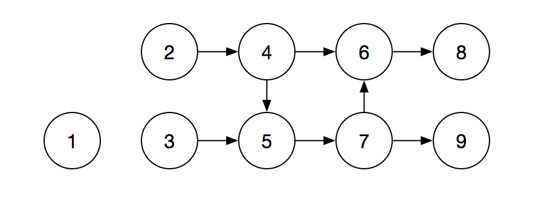
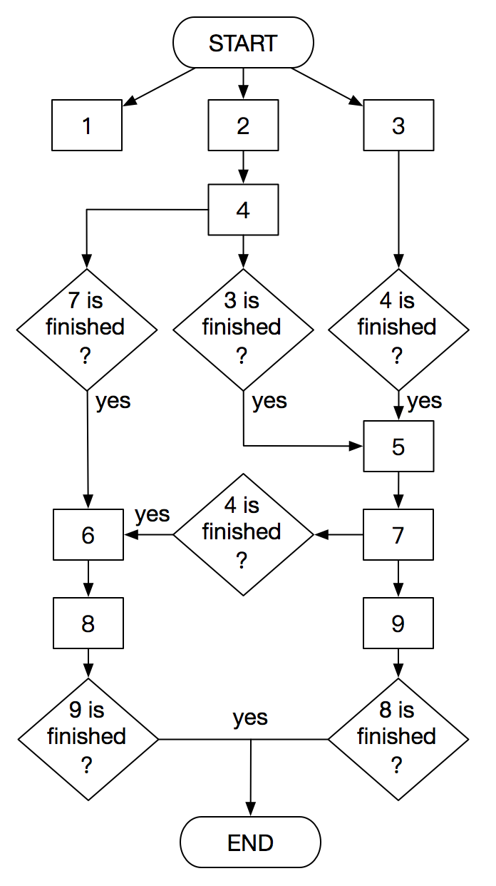

## DAG module

*DAG* 模块负责解决 *Node* 之间的依赖和调度问题。

### DAG schedule

假设我们有一个 *DAG*，其依赖关系如下图：

则此 *DAG* 调度情况如下：

### Core components

*DAG* 模块核心组件有：

- ***DAG***：有向无环图，代表 *Node* 之间的依赖关系。
  - ***Node***：*DAG* 中的节点，代表作业。
  - ***Edge***：*DAG* 中的有向边，代表两个 *Node* 之间的依赖关系。
- ***DAGScheduler***：*DAG* 调度器，负责调度 *DAG* 运行。*DAGScheduler* 并不执行 *Node*，而是将 *Node* 提交给 *NodeDistributor* 发布。
  - ***DAGSchedule***：*DAG* 的调度情况。
  - ***DAGScheduleListener***：*DAG* 调度监听器，负责监听 *DAG* 的调度情况。
- ***NodeDistributor***：*Node* 发布器，负责将 *Node* 发布给工作者 。
  - ***NodeDistribution***：*Node* 的发布情况。
  - ***NodeDistributionListener***：*Node* 发布监听器，负责监听 *Node* 的发布情况。

*DAG* 模块核心组件之间工作原理如下：