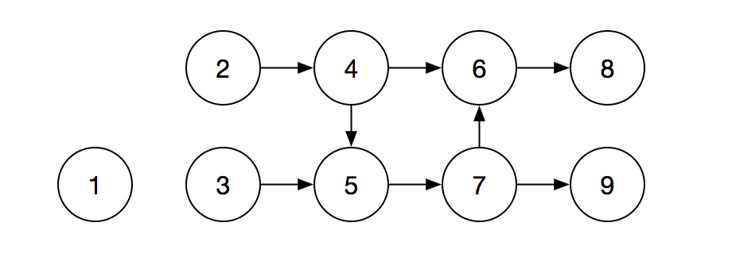
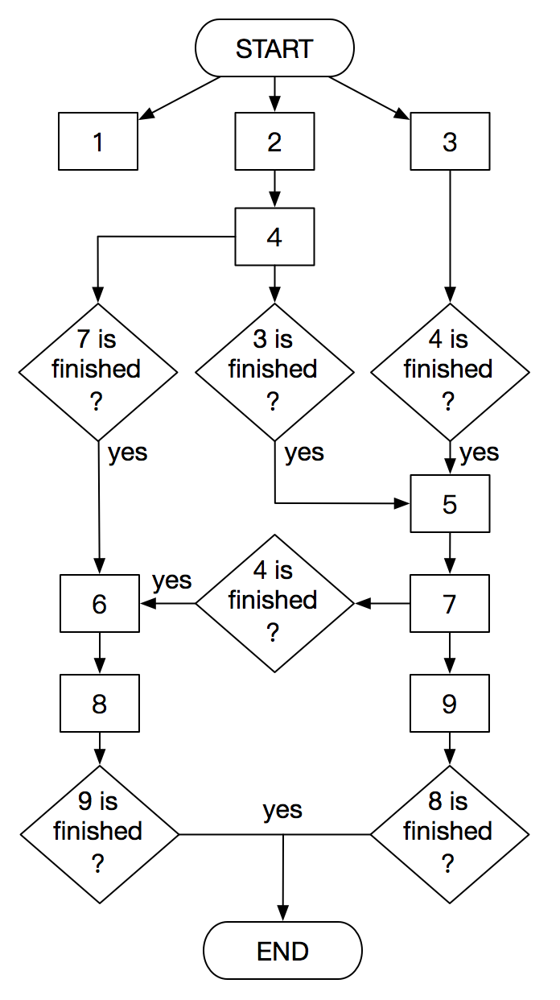

## Dag module

*Dag* 模块负责解决 *Node* 之间的依赖和调度问题。

### Dag schedule

假设我们有一个 *Dag*，其依赖关系如下图：

则此 *Dag* 调度情况如下：

### Core components

*Dag* 模块核心组件有：

- ***Dag***：有向无环图，代表 *Node* 之间的依赖关系。
  - ***Node***：*Dag* 中的节点，代表作业。
  - ***Edge***：*Dag* 中的有向边，代表两个 *Node* 之间的依赖关系。
- ***DagScheduler***：*Dag* 调度器，负责调度 *Dag* 运行。*DagScheduler* 并不执行 *Node*，而是将 *Node* 提交给 *NodeDistributor* 发布。
  - ***DagSchedule***：*Dag* 的调度情况。
  - ***DagScheduleListener***：*Dag* 调度监听器，负责监听 *Dag* 的调度情况。
- ***NodeDistributor***：*Node* 发布器，负责将 *Node* 发布给工作者 。
  - ***NodeDistribution***：*Node* 的发布情况。
  - ***NodeDistributionListener***：*Node* 发布监听器，负责监听 *Node* 的发布情况。